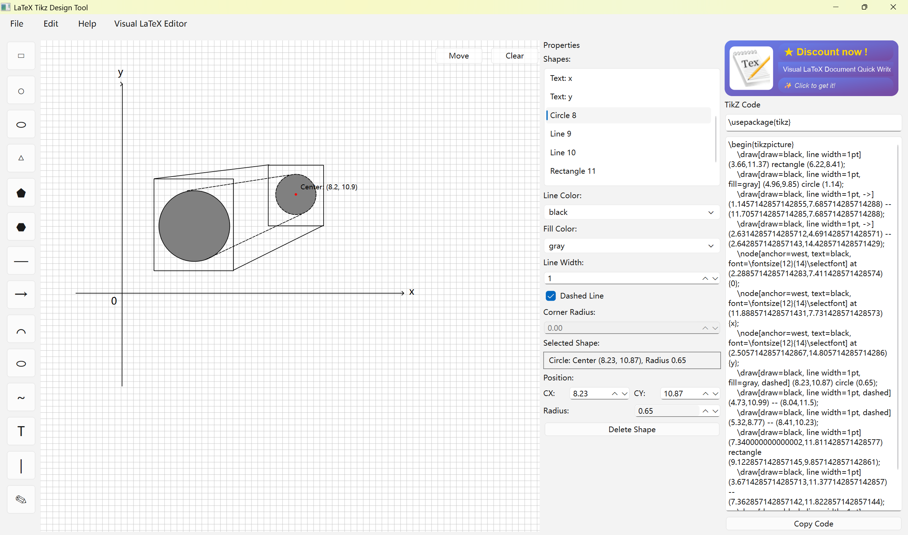
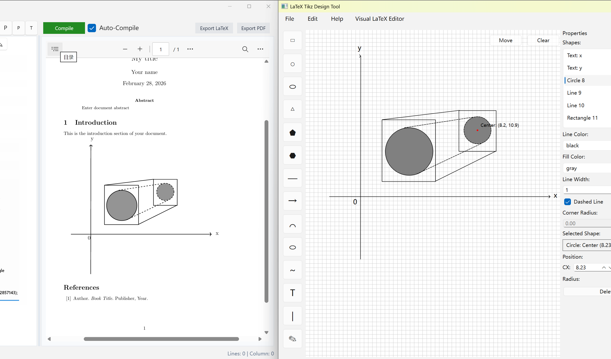

# LaTeX-Tikz-Design-Tool

[](https://apps.microsoft.com/detail/9MWKTCF1VHZ)




> A visual, code-free tool for creating professional TikZ graphics and generating ready-to-compile LaTeX code.

---

## 📝 Overview

LaTeX TikZ Design Tool is a PySide6-based desktop application that empowers users to create complex TikZ graphics through an intuitive drag-and-drop interface, eliminating the need to manually write TikZ code. It provides real-time code generation and preview, making it ideal for academics, researchers, and technical writers who need to include high-quality diagrams in their LaTeX documents.

## ✨ Key Features

- **Visual Drawing Canvas**: Draw shapes (lines, rectangles, circles, ellipses, polygons), arrows, and coordinate axes with simple mouse interactions.
- **Style Customization**: Adjust line color, fill color, line width, dashed/dotted styles, and apply gradient fills (linear/radial).
- **Real-Time Code Preview**: See TikZ code update instantly as you draw, with syntax validation for error-free output.
- **Shape Management**: Select, move, resize, and delete shapes; adjust properties like position, radius, and corner radius in the properties panel.
- **pgfplots Integration**: Generate professional charts and plots directly within the tool, with seamless integration into your TikZ code.
- **One-Click Export**: Copy complete, ready-to-compile TikZ code to your clipboard for immediate use in LaTeX documents.

## 🚀 Getting Started

### Prerequisites

- Python 3.8+
- PySide6

### Installation

1. Clone the repository:
    ```bash
    git clone https://github.com/kaishistudio/LaTeX-Code-Rapid-Generation-Tool.git
